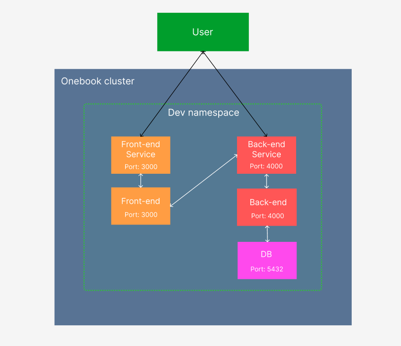

# OneBook Front-end

**Onebook** is a website allowing artists to publish their work and create their online "book".

## Run Locally

> The backend need to be started before

```
npm start
```

## Run in a Kubernetes Development Cluster

### Prerequisites

- Kubernetes distribution (examples: _k3s_ or _minikube_)
- Kubectl CLI
- Docker

### Start the application

> The [backend](https://github.com/EstebanBAR0N/onebook-backend) need to be started first.

1. Build and test the onebook-frontend image with _Docker_

```bash
# get the backend service external IP
kubectl get services -n dev

docker build --build-arg REACT_APP_API_URL=http://<backend-service-external-ip>:4000 -t onebook-frontend:dev .

docker run --rm --name onebook-frontend -p 3000:3000 onebook-frontend:dev

# access the application
curl http://localhost:3000

docker stop onebook-frontend
```

2. Add your custom image to the k3d cluster

```bash
k3d image import onebook-frontend:dev -c onebook
```

3. Deploy the application

```bash
kubectl apply -f infra-as-code/

# verify the deployment
kubectl get deployments -n dev

# verify the service and get its external IP
kubectl get services -n dev

# access the application
curl http://<service-external-ip>:3000
```

### Clean

To clean the Kubernetes dev namespace:

```bash
kubectl delete -f infra-as-code/
```

## Schema of the global application running on Kubernetes


